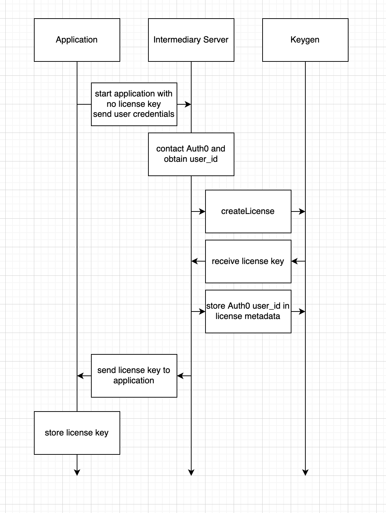
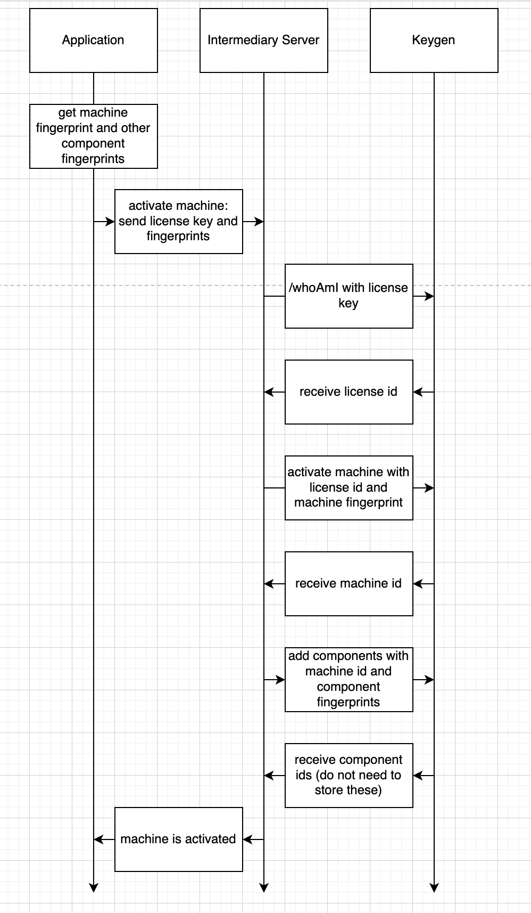
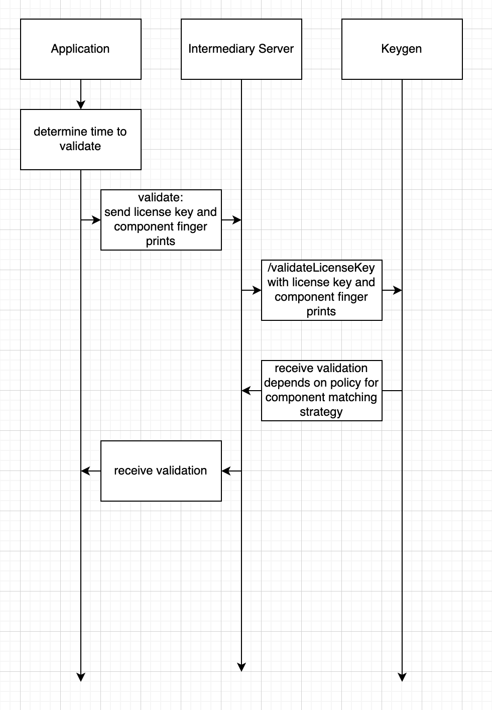

# runtime_keygen_sdk

Dart SDK for [Keygen](https://keygen.sh)


## Overview

Keygen is a fair source software licensing and distribution API. This package is meant to be used on the server and the
client. Most actions in the Keygen API are supported.

[Getting started with Keygen](https://keygen.sh/docs/getting-started/)

[Introduction to the Keygen API](https://keygen.sh/docs/api/)


## Uses

This package will be useful for Dart applications that want to use Keygen for software licensing or distribution.


## Supported platforms

All platforms that can use the `http` package are supported.


## Installation

To add `runtime_keygen_sdk` to your Dart package, include it in your pubspec.yaml file:
```yaml
dependencies:
  runtime_keygen_sdk: ^1.0.0
```


## Setup

In order to use the Dart SDK for Keygen, you must first create a Keygen account.

Follow the instructions for [Getting Started](https://keygen.sh/docs/getting-started/) and take note of your:
* Keygen AccountID
* Admin Email
* Admin Password


## Example

Here is a pseudocode example of calling the Keygen API.

Note that this example will NOT work out-of-the-box.

```
KeygenClient client = KeygenClient('<accountId>');

KeygenLicensesApi licensesApi = KeygenLicensesApi(client);

License license = await licensesApi.createLicense(
    token: token,
    policy: policy,
    user: user
);
```


## Tests

Create a `.env` file and place it in the root of the package.

The `.env` file needs to contain the Keygen AccountID, Admin Email, and Admin Password, specified like this:
```
KEYGEN_ACCOUNTID=<accountid>
KEYGEN_ADMIN_EMAIL=<email>
KEYGEN_ADMIN_PASSWORD=<password>
```

Then you can run:
```
dart test
```

### Why are there so many calls to `await Future.delayed(wait);` in the tests?

Keygen enforces [Rate Limiting](https://keygen.sh/docs/api/rate-limiting/) and the delays are intended to prevent
extraneous load.

These calls need to be in-between API calls; simply putting delays in `setUp` and `tearDown` is not sufficient.


## Supported actions

Most actions in the Keygen API are supported, but not all.

The Keygen API can be divided into a few different categories:
* [Tokens](https://keygen.sh/docs/api/tokens/)
* [Products](https://keygen.sh/docs/api/products/)
* [Entitlements](https://keygen.sh/docs/api/entitlements/)
* [Policies](https://keygen.sh/docs/api/policies/)
* [Users](https://keygen.sh/docs/api/users/)
* [Licences](https://keygen.sh/docs/api/licenses/)
* [Machines](https://keygen.sh/docs/api/machines/)
* Miscellaneous

Tokens are used by Keygen for authenticating API requests.

Products are used to segment policies and licenses, in the case where you sell multiple products. This allows you to
keep licenses and policies between multiple products organized.

Entitlements can be attached to policies and to licenses to grant named "permissions" for things such as application
features. Entitlements can be attached to the following resources:
* Policies: Any entitlement attached to a policy will automatically be attached to all licenses which implement the given policy. 
* Licenses: Entitlements attached to a license are one-off and only apply to that specific license resource. 
* Releases: Entitlements can be attached to releases through constraints, in order to assert that a given licensee possesses the necessary entitlements before being allowed to access a release's artifacts.

Policies define the different "types" of licenses that your product offers. Policies can be for a number of different
things, from different "tiers" for your product (e.g. Basic vs Pro) to fine-grained feature policies.

Users represent an identity for an end-user, or licensee, of your software.

Licenses are used to grant access to your software. Each license resource will implement a policy, which will define
the "rules" which that license must follow to remain valid. Each license can be associated with a user, but that's
optional; this is useful when you're associating multiple licenses with a single user.

Machines can be used to track and manage where your users are allowed to use your product.

There are other less common categories as well:
* [Components](https://keygen.sh/docs/api/components/)
* [Environments](https://keygen.sh/docs/api/environments/)
* [Processes](https://keygen.sh/docs/api/processes/)
* Distribution

Components are hardware components for machines.

Environments can be created to segment your Keygen resources into buckets, for example, for an isolated sandbox
environment, or a shared production environment.

Processes are concurrent processes across machines.

Distribution is the distribution and updating of software via Keygen.

Below are tables that outline which actions are implemented for each category, as well as what tests exist and where
the actions fit in the Client / Server dichotomy.

TLDR:
* User actions and License actions (except validating and checking-in) will run on server-side.
* License validating, license checking-in, and Machine actions will run on client-side.

NOTE: Not every action will be executed client-side or server-side. Some actions (e.g. `createProduct`) are only
executed during initial setup and are not executed during regular client / server interaction.

| [Token Actions](https://keygen.sh/docs/api/tokens/)                     | Implemented | Tests | Client / Server |
|-------------------------------------------------------------------------|-------------|-------|-----------------|
| [createToken](https://keygen.sh/docs/api/tokens/#tokens-generate)       | ✅           | ✅     |                 |
| [retrieveToken](https://keygen.sh/docs/api/tokens/#tokens-retrieve)     | ✅           | ✅     |                 |
| [regenerateToken](https://keygen.sh/docs/api/tokens/#tokens-regenerate) | ✅           | ✅     |                 |
| [revokeToken](https://keygen.sh/docs/api/tokens/#tokens-revoke)         | ✅           | ✅     |                 |
| [listTokens](https://keygen.sh/docs/api/tokens/#tokens-list)            | ✅           | ✅     |                 |

| [Product Actions](https://keygen.sh/docs/api/products/)                    | Implemented | Tests | Client / Server |
|----------------------------------------------------------------------------|-------------|-------|-----------------|
| [createProduct](https://keygen.sh/docs/api/products/#products-create)      | ✅           | ✅     | One time only   |
| [retrieveProduct](https://keygen.sh/docs/api/products/#products-retrieve)  | ✅           | ✅     |                 |
| [updateProduct](https://keygen.sh/docs/api/products/#products-update)      | ✅           | ✅     |                 |
| [deleteProduct](https://keygen.sh/docs/api/products/#products-delete)      | ✅           | ✅     |                 |
| [listProducts](https://keygen.sh/docs/api/products/#products-list)         | ✅           | ✅     |                 |
| [createProductToken](https://keygen.sh/docs/api/products/#products-tokens) | ✅           | ✅     |                 |

| [Entitlement Actions](https://keygen.sh/docs/api/entitlements/)                       | Implemented | Tests | Client / Server |
|---------------------------------------------------------------------------------------|-------------|-------|-----------------|
| [createEntitlement](https://keygen.sh/docs/api/entitlements/#entitlements-create)     | ✅           | ✅     | One time only   |
| [retrieveEntitlement](https://keygen.sh/docs/api/entitlements/#entitlements-retrieve) | ✅           | ✅     |                 |
| [updateEntitlement](https://keygen.sh/docs/api/entitlements/#entitlements-update)     | ✅           | ✅     |                 |
| [deleteEntitlement](https://keygen.sh/docs/api/entitlements/#entitlements-delete)     | ✅           | ✅     |                 |
| [listEntitlements](https://keygen.sh/docs/api/entitlements/#entitlements-list)        | ✅           | ✅     |                 |

| [Policy Actions](https://keygen.sh/docs/api/policies/)                                                      | Implemented | Tests | Client / Server |
|-------------------------------------------------------------------------------------------------------------|-------------|-------|-----------------|
| [createPolicy](https://keygen.sh/docs/api/policies/#policies-create)                                        | ✅           | ✅     | One time only   |
| [retrievePolicy](https://keygen.sh/docs/api/policies/#policies-retrieve)                                    | ✅           | ✅     |                 |
| [updatePolicy](https://keygen.sh/docs/api/policies/#policies-update)                                        | ✅           | ✅     |                 |
| [deletePolicy](https://keygen.sh/docs/api/policies/#policies-delete)                                        | ✅           | ✅     |                 |
| [listPolicies](https://keygen.sh/docs/api/policies/#policies-list)                                          | ✅           | ✅     |                 |
| [attachPolicyEntitlements](https://keygen.sh/docs/api/policies/#policies-relationships-attach-entitlements) | ✅           | ✅     |                 |
| [detachPolicyEntitlements](https://keygen.sh/docs/api/policies/#policies-relationships-detach-entitlements) | ✅           | ✅     |                 |
| [listEntitlements](https://keygen.sh/docs/api/policies/#policies-relationships-list-entitlements)           | ✅           | ✅     |                 |

| [User Actions](https://keygen.sh/docs/api/users/)                                 | Implemented | Tests | Client / Server |
|-----------------------------------------------------------------------------------|-------------|-------|-----------------|
| [createUser](https://keygen.sh/docs/api/users/#users-create)                      | ✅           | ✅     |                 |
| [retrieveUser](https://keygen.sh/docs/api/users/#users-retrieve)                  | ✅           | ✅     |                 |
| [updateUser](https://keygen.sh/docs/api/users/#users-update)                      | ✅           | ✅     |                 |
| [deleteUser](https://keygen.sh/docs/api/users/#users-delete)                      | ✅           | ✅     |                 |
| [listUsers](https://keygen.sh/docs/api/users/#users-list)                         | ✅           | ✅     |                 |
| [updatePassword](https://keygen.sh/docs/api/users/#users-actions-update-password) | ✅           | ✅     |                 |
| [resetPassword](https://keygen.sh/docs/api/users/#users-actions-reset-password)   | ✅           | 📧    |                 |
| [banUser](https://keygen.sh/docs/api/users/#users-actions-ban)                    | ✅           | ✅     |                 |
| [unbanUser](https://keygen.sh/docs/api/users/#users-actions-unban)                | ✅           | ✅     |                 |
| [createUserToken](https://keygen.sh/docs/api/users/#users-tokens)                 | ✅           | ✅     |                 |
| [changeGroup](https://keygen.sh/docs/api/users/#users-relationships-change-group) | ❌           | ❌     | ❌               |
| [addSecondFactor](https://keygen.sh/docs/api/users/#second-factors-create)        | ❌           | ❌     | ❌               |
| [retrieveSecondFactor](https://keygen.sh/docs/api/users/#second-factors-retrieve) | ❌           | ❌     | ❌               |
| [updateSecondFactor](https://keygen.sh/docs/api/users/#second-factors-update)     | ❌           | ❌     | ❌               |
| [deleteSecondFactor](https://keygen.sh/docs/api/users/#second-factors-delete)     | ❌           | ❌     | ❌               |
| [listSecondFactors](https://keygen.sh/docs/api/users/#second-factors-list)        | ❌           | ❌     | ❌               |

| [License Actions](https://keygen.sh/docs/api/licenses/)                                               | Implemented | Tests | Client / Server |
|-------------------------------------------------------------------------------------------------------|-------------|-------|-----------------|
| [createLicense](https://keygen.sh/docs/api/licenses/#licenses-create)                                 | ✅           | ✅     | Server          |
| [retrieveLicense](https://keygen.sh/docs/api/licenses/#licenses-retrieve)                             | ✅           | ✅     | Server          |
| [updateLicense](https://keygen.sh/docs/api/licenses/#licenses-update)                                 | ✅           | ✅     | Server          |
| [deleteLicense](https://keygen.sh/docs/api/licenses/#licenses-delete)                                 | ✅           | ✅     | Server          |
| [listLicenses](https://keygen.sh/docs/api/licenses/#licenses-list)                                    | ✅           | ✅     | Server          |
| [validateLicenseByID](https://keygen.sh/docs/api/licenses/#licenses-actions-validate)                 | ✅           | ✅     |                 |
| [validateLicenseByKey](https://keygen.sh/docs/api/licenses/#licenses-actions-validate-key)            | ✅           | ✅     | Client          |
| [suspendLicense](https://keygen.sh/docs/api/licenses/#licenses-actions-suspend)                       | ✅           | ✅     | Server          |
| [reinstateLicense](https://keygen.sh/docs/api/licenses/#licenses-actions-reinstate)                   | ✅           | ✅     | Server          |
| [renewLicense](https://keygen.sh/docs/api/licenses/#licenses-actions-renew)                           | ✅           | ✅     | Server          |
| [revokeLicense](https://keygen.sh/docs/api/licenses/#licenses-actions-revoke)                         | ✅           | ✅     | Server          |
| [checkOutLicense](https://keygen.sh/docs/api/licenses/#licenses-actions-check-out)                    | ❌           | ❌     | ❌               |
| [checkInLicense](https://keygen.sh/docs/api/licenses/#licenses-actions-check-in)                      | ✅           | ✅     | Client          |
| [incrementUsage](https://keygen.sh/docs/api/licenses/#licenses-actions-increment-usage)               | ❌           | ❌     | ❌               |
| [decrementUsage](https://keygen.sh/docs/api/licenses/#licenses-actions-decrement-usage)               | ❌           | ❌     | ❌               |
| [resetUsage](https://keygen.sh/docs/api/licenses/#licenses-actions-reset-usage)                       | ❌           | ❌     | ❌               |
| [createLicenseToken](https://keygen.sh/docs/api/licenses/#licenses-relationships-activation-tokens)   | ✅           | ✅     | Server          |
| [attachUsers](https://keygen.sh/docs/api/licenses/#licenses-relationships-attach-users)               | 🐛          | 🐛    | Server          |
| [detachUsers](https://keygen.sh/docs/api/licenses/#licenses-relationships-detach-users)               | 🐛          | 🐛    | Server          |
| [listUsers](https://keygen.sh/docs/api/licenses/#licenses-relationships-list-users)                   | 🐛          | 🐛    | Server          |
| [attachEntitlements](https://keygen.sh/docs/api/licenses/#licenses-relationships-attach-entitlements) | ✅           | ✅     | Server          |
| [detachEntitlements](https://keygen.sh/docs/api/licenses/#licenses-relationships-detach-entitlements) | ✅           | ✅     | Server          |
| [listEntitlements](https://keygen.sh/docs/api/licenses/#licenses-relationships-list-entitlements)     | ✅           | ✅     | Server          |
| [changeLicensePolicy](https://keygen.sh/docs/api/licenses/#licenses-relationships-change-policy)      | ✅           | ✅     | Server          |
| [changeOwner](https://keygen.sh/docs/api/licenses/#licenses-relationships-change-owner)               | ❌           | ❌     | ❌               |
| [changeGroup](https://keygen.sh/docs/api/licenses/#licenses-relationships-change-group)               | ❌           | ❌     | ❌               |

| [Machine Actions](https://keygen.sh/docs/api/machines/)                                 | Implemented | Tests | Client / Server |
|-----------------------------------------------------------------------------------------|-------------|-------|-----------------|
| [activateMachine](https://keygen.sh/docs/api/machines/#machines-create)                 | ✅           | ✅     | Client          |
| [retrieveMachine](https://keygen.sh/docs/api/machines/#machines-retrieve)               | ✅           | ✅     | Client          |
| [updateMachine](https://keygen.sh/docs/api/machines/#machines-update)                   | ✅           | ✅     | Client          |
| [deactivateMachine](https://keygen.sh/docs/api/machines/#machines-delete)               | ✅           | ✅     | Client          |
| [listAllMachines](https://keygen.sh/docs/api/machines/#machines-list)                   | ✅           | ✅     | Client          |
| [checkOutMachine](https://keygen.sh/docs/api/machines/#machines-actions-check-out)      | ❌           | ❌     | ❌               |
| [pingHeartbeat](https://keygen.sh/docs/api/machines/#machines-actions-ping)             | ✅           | ✅     | Client          |
| [resetHeartbeat](https://keygen.sh/docs/api/machines/#machines-actions-reset)           | ✅           | ✅     | Client          |
| [changeOwner](https://keygen.sh/docs/api/machines/#machines-relationships-change-owner) | 🐛          | 🐛    | Server          |
| [changeGroup](https://keygen.sh/docs/api/machines/#machines-relationships-change-group) | ❌           | ❌     | ❌               |

| Miscellaneous Actions                                                    | Implemented | Tests | Client / Server |
|--------------------------------------------------------------------------|-------------|-------|-----------------|
| [whoAmI](https://keygen.sh/docs/api/profiles/#profiles-retrieve)         | 🐛          | 🐛    | Client / Server |
| [forgotPassword](https://keygen.sh/docs/api/passwords/#passwords-forgot) | ✅           | 📧    |                 |


### Legend

🐛 = bug in generated OpenAPI code from `runtime_keygen_openapi` package

whoAmI currently throws exception when called with license token or product token.
license attachUsers is currently missing from OpenAPI .yml file from `runtime_keygen_openapi` package.
license detachUsers is currently missing from OpenAPI .yml file from `runtime_keygen_openapi` package.
license listUsers is currently missing from OpenAPI .yml file from `runtime_keygen_openapi` package.
machine changeOwner is currently missing from OpenAPI .yml file from `runtime_keygen_openapi` package.

❌ = not planned to be supported (but may be re-evaluated)

📧 = requires reading email

The remaining groups of actions are not supported:
* [Components](https://keygen.sh/docs/api/components/): not yet specified in OpenAPI spec file
* [Environments](https://keygen.sh/docs/api/environments/): not planned to be supported (but may be re-evaluated)
* [Processes](https://keygen.sh/docs/api/processes/): not planned to be supported (but may be re-evaluated)
* Distribution: not planned to be supported (but may be re-evaluated)


## Workflows

There are several common scenarios when using Keygen. These involve interacting with the client application, possibly
some intermediary server, possibly the user's email, and Keygen itself.


### One time:

Various actions may only need to be done once, and may be done from the Keygen dashboard.

Some of these actions are:
* Create a product
* Create entitlements
* Create a policy

When creating a policy, you may want to specify the strategy to use for matching components. You can do that with these
attributes:
```
requireComponentsScope = true
componentMatchingStrategy = MATCH_ANY, MATCH_TWO, MATCH_MOST, MATCH_ALL
```

### Workflow: Creating a license



Pseudocode for the client application would be:
```
1. start the application with no license key
2. send user credentials to intermediary server, and ask to create a new license
3. application receives license key from intermediary server
4. application stores license key
```

Pseudocode for the intermediary server would be:
```
1. receive request from application to create license
2. contact Auth0 to obtain user_id
3. send /createLicense request to Keygen
4. receive response from Keygen with license key and license id
5. send /updateLicense request to Keygen, with license id and Auth0 user_id to store in metadata
6. send license key to application
```

### Workflow: Activating a machine



Pseudocode for the client application would be:
```
1. get machine id and other component fingerprints
2. ask intermediary server to activate the machine, and send license key and component fingerprints
3. receive response from intermediary server that machine is activated
```

Pseudocode for the intermediary server would be:
```
1. receive request from application to activate machine with various fingerprints
2. send /whoAmI to Keygen with license key
3. receive license id
4. send /activateMachine to Keygen with license id and machine fingerprint
5. receive machine id
6. send /addComponent to Keygen with machine id and component fingerprints
7. send machine activation to application
```

### Workflow: Validating a license



Pseudocode for the client application would be:
```
1. determine that it is time to validate license
2. send request to validate to intermediary server, with license key and fingerprints
3. receive validation from server
```

Pseudocode for the intermediary server would be:
```
1. receive request for validation from application, with license key and fingerprints
2. send /validateLicenseKey to Keygen, with license key and fingerprints
3. receive validation from Keygen
4. send validation to application
```


## Caveats

### Updating metadata

Since the metadata attribute is simply a key-value store (object), all write operations will overwrite the entire
object, so be sure to merge existing data on your end when performing updates.

Metadata is not inheritable.

https://keygen.sh/docs/api/metadata/

https://github.com/orgs/keygen-sh/discussions/106


## Implementation details

### Modifications from generated OpenAPI code

This package uses `runtime_keygen_openapi`, which includes generated OpenAPI code.

OpenAPI defines some parameters as `Object? metadata`, but these have been modified to be `Map<String, String>? metadata`.

OpenAPI defines some parameters as `Object? page`, but these have been modified to be `Map<String, int>? page`.


